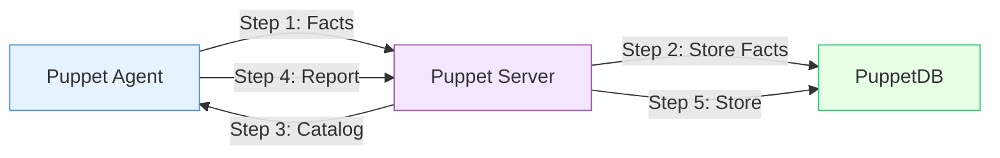

# Logstash PuppetDB input plugin POC Demo

This Demo describes the outcome of an On Week (11/25-11/27 2024) project descrived in https://github.com/elastic/ingest-dev/issues/4491

## PuppetDB verview

1. Agent collects system facts and sends them to Puppet Server
2. Server stores these facts in PuppetDB for later querying
3. Server compiles and sends a catalog tailored for this agent
4. After applying changes, agent sends a report back to server
5. Server stores the report and resource data in PuppetDB for tracking and querying

- With this architecture a wealth of information is stored in PuppetDB (we will focus first on `facts`, `catalogs`, and `reports`).

- An both open source deployments as well as enterprise use the same PuppetDB API. 

- Puppet Enterpise offers overview features (report viewer, facts viewer) proving this is valuable. 

- A plugin for ingesting this data to ELK could benefit both enterprise and OS users. 

## Plugin design

The existing [puppet_facter](https://github.com/logstash-plugins/logstash-input-puppet_facter) plugin queried puppetserver for facts which is deprecated. 

The first iteration of the plugin was simply to periodically query PuppetDB and transform the data in logical events. For this first pass that basically boiled down to this very simple strategy:

1. Ask PuppetDB for all the nodes it knows about
2. Take that list of nodes and query for its last facts, catalog, and report
3. Compile an event consisting of a nodes information gathered in step 2 and send it along in the pipeline.

## Plugin improvements

1. Scalability: batch nodes and use pagination
2. Flexibility: Allow fine grained control of what to collect, perhaps expose a way to run user provided AST against a desired endpoint. 
3. Feedback: Get a release on rubygems and ask PuppetDB maintainers and Puppet users for feedback

## How can I help?

1. I'm new, and as sure I'm not doing things idiomatically or am unaware of best practices, please point these out! 
2. If you have a knack for data visualization I would love some help building out visuals that are compelling for a blog post. 

